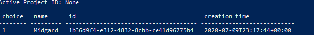

# Unity Simulation Research
<!-- ALL-CONTRIBUTORS-BADGE:START - Do not remove or modify this section -->
[](#contributors-)
<!-- ALL-CONTRIBUTORS-BADGE:END -->
Unity Simulation

## Developing a Simulation
| Section | Description |
|---|---|
|[Unity Simulation SDK](doc/integrate.md) | Developing with the Unity Simulation SDK|
|[Unity Linux build](doc/build.md) | How to make a Linux build|
|[Linux Build Testing](doc/testing.md) | Testing Linux build locally|

## Activate Unity Project

macOS: 
``` terminal
$ USimCLI/mac/usim activate project
```

Windows: 
``` powershell
>USimCLI\windows\usim.exe activate project
```
After your Unity Cloud Project ID has been activated you can begin uploading the files and data needed for your simulation.



## Ground Control to Major Tom

As of July 13, 2020 all commands have to be executed from the unity_simulation_bundle directory.

**Windows**
```
> USimCLI\windows\usim.exe login auth
> USimCLI\windows\usim.exe activate project
```
```
> USimCLI\windows\usim.exe upload build RollaballLinuxBuild\rollaball_linux_build.zip
    # Outputs  Build ID
```
```
> USimCLI\windows\usim.exe upload app-param AppParams\app-param.json
    #  Outputs AppParam ID
```
```
> USimCLI\windows\usim.exe define run
    # Outputs Run Definition ID
```
```
> USimCLI\windows\usim.exe execute run <run-def-id>
    # Outputs Run Execution ID
```
```
# Simulation Status
> USimCLI\windows\usim.exe summarize run-execution <exec-id>
> USimCLI\windows\usim.exe describe run-execution <exec-id> --states=in-progress,failed
```
```
# After Simulation shows a 'Complete' status download data
> USimCLI\windows\usim.exe download manifest <exec-id> --save-in=RunExecutionData
 ```
 
# Upload Build

macOS:

$ USimCLI/mac/usim upload build RollaballLinuxBuild/rollaball_linux_build.zip
Windows:

> USimCLI\windows\usim.exe upload build RollaballLinuxBuild\rollaball_linux_build.zip

## Contributors ✨

Thanks goes to these wonderful people ([emoji key](https://allcontributors.org/docs/en/emoji-key)):

<!-- ALL-CONTRIBUTORS-LIST:START - Do not remove or modify this section -->
<!-- prettier-ignore-start -->
<!-- markdownlint-disable -->
<table>
  <tr>
    <td align="center"><a href="http://www.amiedd.com"><br /><sub><b>Amie DD</b></sub></a><br /><a href="https://github.com/AmieDD/Unity-Simulation-Research/commits?author=AmieDD" title="Code">💻</a></td>
  </tr>
</table>

<!-- markdownlint-enable -->
<!-- prettier-ignore-end -->
<!-- ALL-CONTRIBUTORS-LIST:END -->

This project follows the [all-contributors](https://github.com/all-contributors/all-contributors) specification. Contributions of any kind welcome!
